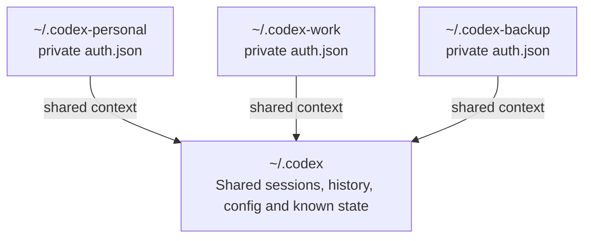

# codex-profile-manager

[](https://github.com/roshkatan98/codex-profile-manager/actions/workflows/ci.yml)
[](LICENSE)
[](https://www.gnu.org/software/bash/)
[](https://www.kernel.org/)

An unofficial profile manager for Codex CLI.

Use multiple legitimate Codex authentication profiles on one machine while sharing the same sessions, history, configuration, and project context.

> This project is not affiliated with or endorsed by OpenAI. It does not modify the Codex binary and is not intended to bypass service limits or terms.

## Demo

```console
$ codexpm list
Active account: personal

* personal     /home/user/.codex-personal (auth present)
  work         /home/user/.codex-work     (auth present)
  backup       /home/user/.codex-backup   (auth present)

$ codexpm use work
Active Codex account is now: work

$ codexpm run
Using Codex account: work

# Work normally, then exit with /quit
Switch to account backup and resume? [y/N] y
Switched Codex account: work -> backup
```

## Why this exists

Codex stores local state under a Codex home directory, usually `~/.codex`.

Completely separate homes split your sessions and context. A single shared home mixes authentication. `codex-profile-manager` separates authentication while sharing the Codex state you actually want to keep.



## Features

- Any number of numeric or named profiles
- Separate authentication for every profile
- Shared sessions, history, configuration, and project context
- Direct profile selection and ordered rotation
- Resume the latest session or start a fresh one
- Original Codex binary remains untouched

## Requirements

- Linux
- Bash 4+
- Codex CLI already installed and logged in once
- `flock` and standard Unix utilities

Native Windows and standard macOS installations are not currently supported. See the [FAQ](docs/FAQ.md).

## Quick start

```bash
git clone https://github.com/roshkatan98/codex-profile-manager.git
cd codex-profile-manager
```

Preview the installation:

```bash
CODEX_BIN="$HOME/.local/bin/codex" \
CODEX_ORIGINAL_HOME="$HOME/.codex" \
CODEX_ACCOUNTS="1:$HOME/.codex-1 2:$HOME/.codex-2 3:$HOME/.codex-3" \
bash install.sh --dry-run
```

Install:

```bash
CODEX_BIN="$HOME/.local/bin/codex" \
CODEX_ORIGINAL_HOME="$HOME/.codex" \
CODEX_ACCOUNTS="1:$HOME/.codex-1 2:$HOME/.codex-2 3:$HOME/.codex-3" \
bash install.sh
```

The installer keeps the original Codex binary unchanged, creates the profiles, and links the shared Codex state.

## Login additional profiles

The first profile inherits the existing Codex login. Additional profiles start logged out.

```bash
codexpm login 2
codexpm login 3
```

Verify:

```bash
codexpm status
```

## Main commands

```bash
codexpm list                  # list configured profiles
codexpm status                # show login status for every profile
codexpm use 2                 # select profile 2
codexpm next                  # rotate to the next profile
codexpm add 4                 # add another profile
codexpm login 4               # log in the new profile
codexpm logout 4              # log out one profile
codexpm run                   # resume the latest session
codexpm run new               # start a fresh session
codexpm run all               # resume across all sessions
codexpm doctor                # validate the setup
```

The rotation order follows `CODEX_ACCOUNTS`:

```bash
CODEX_ACCOUNTS="main:$HOME/.codex-main work:$HOME/.codex-work backup:$HOME/.codex-backup"
```

```text
main -> work -> backup -> main
```

## Optional `codex` command

To make `codex` use the profile manager while leaving the original binary untouched:

```bash
cat templates/bashrc-snippet.sh >> ~/.bashrc
source ~/.bashrc
```

Then:

```bash
codex          # resume with the active profile
codex new      # start a new session
codex status   # show profile statuses
```

## Configuration

The default configuration file is:

```text
~/.config/codex-profile-manager/config.env
```

See [`templates/config.env.example`](templates/config.env.example).

## Documentation

- [Frequently asked questions](docs/FAQ.md)
- [Architecture](docs/architecture.md)
- [Add a profile](docs/add-account.md)
- [Migration from older installations](docs/migration.md)
- [Restore and uninstall](docs/restore.md)
- [Troubleshooting](docs/troubleshooting.md)
- [v1.0.0 release notes](docs/releases/v1.0.0.md)

## Security

Authentication is kept separate between profiles. Unknown Codex files are not shared automatically.

Never commit `auth.json`, access tokens, refresh tokens, device-login codes, or private session content. Read [`SECURITY.md`](SECURITY.md).

## Project status

Codex CLI state layouts may change in future releases. Run `codexpm doctor` after Codex upgrades.

## License

MIT. See [`LICENSE`](LICENSE).
