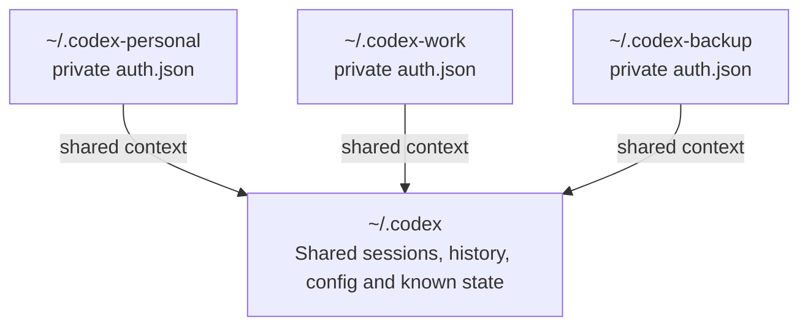

# codex-profile-manager

[](https://github.com/roshkatan98/codex-profile-manager/actions/workflows/ci.yml)
[](LICENSE)
[](https://www.gnu.org/software/bash/)
[](https://www.kernel.org/)

An unofficial profile manager for Codex CLI.

Use multiple legitimate Codex authentication profiles on one machine while sharing the same sessions, history, configuration, and project context.

> This project is not affiliated with or endorsed by OpenAI. It does not modify the Codex binary and is not intended to bypass service limits or terms.

## Demo

```console
$ codexpm list
Active profile: personal

* personal         /home/user/.codex-personal (auth present)
  work             /home/user/.codex-work (auth present)
  backup           /home/user/.codex-backup (auth present)

$ codexpm use work
Active Codex profile is now: work

$ codexpm run
Using Codex profile: work

# Work normally, then exit with /quit
Switch to profile backup and resume? [y/N] y
Switched Codex profile: work -> backup
```

## Why this exists

Codex stores local state under a Codex home directory, usually `~/.codex`.

Completely separate homes split your sessions and context. A single shared home mixes authentication. `codex-profile-manager` separates authentication while sharing the Codex state you want to keep.



## Features

- Any number of numeric or named profiles
- Interactive setup wizard
- Separate authentication for every profile
- Shared sessions, history, configuration, and project context
- Direct profile selection and ordered rotation
- Add or remove profiles later
- Built-in updates to the latest stable release
- Safe uninstall that restores the original Codex setup
- Original Codex binary remains untouched

## Requirements

- Linux
- Bash 4+
- Codex CLI already installed and logged in once
- `flock` and standard Unix utilities
- `curl` or `wget` for built-in updates

Native Windows and standard macOS installations are not currently supported. See the [FAQ](docs/FAQ.md).

## Install

```bash
git clone https://github.com/roshkatan98/codex-profile-manager.git
cd codex-profile-manager
bash install.sh
```

The setup wizard asks:

1. how many profiles you want;
2. whether you want to name them;
3. for final confirmation before making changes.

Names are optional. Press Enter to use numeric defaults such as `1`, `2`, and `3`.

The first profile uses your current Codex login. Additional profiles start logged out:

```bash
codexpm login 2
codexpm login 3
```

With named profiles:

```bash
codexpm login work
codexpm login backup
```

### Non-interactive install

```bash
CODEX_BIN="$HOME/.local/bin/codex" \
CODEX_ORIGINAL_HOME="$HOME/.codex" \
CODEX_ACCOUNTS="personal:$HOME/.codex-personal work:$HOME/.codex-work" \
bash install.sh --yes
```

Preview either setup without changing files:

```bash
bash install.sh --wizard --dry-run
```

## Main commands

```bash
codexpm list                         # list configured profiles
codexpm status                       # show login status
codexpm use work                     # select a profile
codexpm next                         # rotate to the next profile
codexpm add backup                   # add a profile
codexpm login backup                 # log in that profile
codexpm logout backup                # log out that profile
codexpm run                          # resume the latest session
codexpm run new                      # start a fresh session
codexpm run all                      # resume across all sessions
codexpm update --check               # check for a stable update
codexpm update                       # install the latest stable release
codexpm doctor                       # validate the setup
```

The rotation order follows the profile order created during setup.

## Remove a profile

Remove it from the rotation while preserving its local files:

```bash
codexpm remove backup
```

Remove it and permanently delete its local profile directory:

```bash
codexpm remove backup --delete-files
```

Shared sessions and history remain in the original Codex home. The last configured profile cannot be removed accidentally.

## Update

Check for a newer stable release:

```bash
codexpm update --check
```

Install it:

```bash
codexpm update
```

The updater downloads the latest stable GitHub release, preserves the existing configuration and authentication profiles, upgrades the installed files, and runs `codexpm doctor` automatically.

Users upgrading from a version that predates the built-in updater need one final manual update from a repository checkout:

```bash
git pull --ff-only
bash install.sh --upgrade --yes
codexpm doctor
```

Future updates can then use `codexpm update`.

## Uninstall

Remove the manager commands and shell integration while preserving profile files and configuration:

```bash
codexpm uninstall
```

Remove the manager and its verified profile directories, returning to the original Codex setup:

```bash
codexpm uninstall --purge
```

The original Codex binary, original `~/.codex` directory, and backups are never removed.

## Optional `codex` command

To make `codex` use the active managed profile:

```bash
cat templates/bashrc-snippet.sh >> ~/.bashrc
source ~/.bashrc
```

Then:

```bash
codex          # resume with the active profile
codex new      # start a new session
codex status   # show profile statuses
```

## Configuration

The default configuration file is:

```text
~/.config/codex-profile-manager/config.env
```

See [`templates/config.env.example`](templates/config.env.example).

## Documentation

- [Frequently asked questions](docs/FAQ.md)
- [Architecture](docs/architecture.md)
- [Add or remove a profile](docs/add-account.md)
- [Restore and uninstall](docs/restore.md)
- [Troubleshooting](docs/troubleshooting.md)

## Security

Authentication is kept separate between profiles. Unknown Codex files are not shared automatically.

Never commit `auth.json`, access tokens, refresh tokens, device-login codes, or private session content. Read [`SECURITY.md`](SECURITY.md).

## Project status

Codex CLI state layouts may change in future releases. Run `codexpm doctor` after Codex upgrades.

## License

MIT. See [`LICENSE`](LICENSE).
