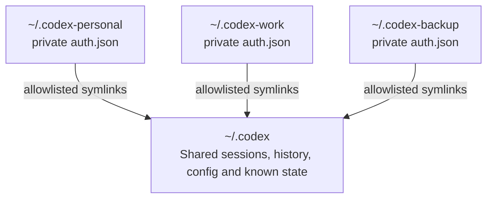

# codex-profile-manager

[](https://github.com/roshkatan98/codex-profile-manager/actions/workflows/ci.yml)
[](LICENSE)
[](https://www.gnu.org/software/bash/)
[](https://www.kernel.org/)

An unofficial profile manager for Codex CLI.

Use multiple legitimate Codex authentication profiles on one machine while sharing the same sessions, history, configuration, and project context.

> This project is not affiliated with or endorsed by OpenAI. It does not modify the Codex binary and is not intended to bypass service limits or terms.

## Demo

```console
$ codexpm list
Active account: personal

* personal     /home/user/.codex-personal (auth present)
  work         /home/user/.codex-work     (auth present)
  backup       /home/user/.codex-backup   (auth present)

$ codexpm use work
Active Codex account is now: work

$ codexpm run
Using Codex account: work

# Work normally, then exit with /quit
Switch to account backup and resume? [y/N] y
Switched Codex account: work -> backup
```

## Why this exists

Codex stores local state under a Codex home directory, usually `~/.codex`. If every account uses a completely separate home, sessions and context become fragmented. If every account shares the same home, authentication collides.

`codex-profile-manager` keeps authentication separate and shares only an explicit allowlist of state.



Unknown future Codex files are not shared automatically.

## Features

- N authentication profiles, with numeric or named ids
- Shared sessions, history, configuration, memories, and known state files
- Manual account selection and ordered rotation
- Optional prompt to rotate after `/quit`
- Per-user process lock to prevent concurrent writes to shared state
- Safe backup with free-space validation
- Legacy migration from `codex2keys`
- Original Codex binary remains untouched
- Compatibility commands: `codex_smart`, `codex_switch`, and `codex_add_account`

## Requirements

- Linux
- Bash 4+
- Codex CLI already installed and logged in once
- `flock`, `readlink`, `du`, `df`, `awk`, and standard coreutils

Native Windows and standard macOS installations are not currently supported. See the [FAQ](docs/FAQ.md).

## Quick start

Clone the repository:

```bash
git clone https://github.com/roshkatan98/codex-profile-manager.git
cd codex-profile-manager
```

Preview the installation:

```bash
CODEX_BIN="$HOME/.local/bin/codex" \
CODEX_ORIGINAL_HOME="$HOME/.codex" \
CODEX_ACCOUNTS="1:$HOME/.codex-1 2:$HOME/.codex-2 3:$HOME/.codex-3" \
bash install.sh --dry-run
```

Install:

```bash
CODEX_BIN="$HOME/.local/bin/codex" \
CODEX_ORIGINAL_HOME="$HOME/.codex" \
CODEX_ACCOUNTS="1:$HOME/.codex-1 2:$HOME/.codex-2 3:$HOME/.codex-3" \
bash install.sh
```

The installer:

1. validates the original Codex installation;
2. verifies enough free space exists for a backup;
3. copies the original authentication only into the first profile;
4. creates every additional profile without `auth.json`;
5. links only the approved shared-state allowlist;
6. installs `codexpm` and compatibility wrappers without changing the Codex binary.

## Login additional accounts

The first profile inherits the authentication from the original Codex home. Additional profiles intentionally start logged out.

```bash
codexpm login 2
codexpm login 3
```

Verify:

```bash
codexpm status
sha256sum "$HOME/.codex-1/auth.json" \
          "$HOME/.codex-2/auth.json" \
          "$HOME/.codex-3/auth.json"
```

The hashes should be different.

## Main commands

```bash
codexpm list                  # list configured profiles
codexpm status                # show Codex login status for every profile
codexpm use 2                 # select account 2
codexpm next                  # rotate to the next configured account
codexpm add 4                 # add another profile without copying auth
codexpm login 4               # login the new profile
codexpm logout 4              # logout one profile without touching the others
codexpm run                   # resume the latest session
codexpm run new               # start a fresh Codex session
codexpm run all               # resume across all sessions
codexpm doctor                # validate permissions, auth isolation, and shared links
codexpm migrate               # migrate legacy config and links
```

The rotation order is the order in `CODEX_ACCOUNTS`:

```bash
CODEX_ACCOUNTS="main:$HOME/.codex-main work:$HOME/.codex-work backup:$HOME/.codex-backup"
```

```text
main -> work -> backup -> main
```

## Optional `codex` shell function

To make `codex` use the profile manager while leaving the original binary untouched:

```bash
cat templates/bashrc-snippet.sh >> ~/.bashrc
source ~/.bashrc
```

Then:

```bash
codex          # resume with the active profile
codex new      # start a new session
codex status   # show all profile statuses
```

You can always call the original binary by its full path from `CODEX_BIN`.

## Configuration

The default configuration file is:

```text
~/.config/codex-profile-manager/config.env
```

Override it with:

```bash
export CODEX_PROFILE_MANAGER_CONFIG=/custom/path/config.env
```

The custom path is honored by install, migration, and later profile additions. See [`templates/config.env.example`](templates/config.env.example).

### Shared-state allowlist

The default allowlist is:

```bash
CODEX_SHARED_ITEMS="config.toml sessions history.jsonl session_index.jsonl memories attachments skills rules prompts archived_sessions state_*.sqlite state_*.sqlite-*"
```

This is deliberately conservative. Add an item only after confirming it is not authentication-specific or account-specific.

## Upgrading from `codex2keys`

The manager detects `~/.codex2keys.env` when the new config is absent.

```bash
bash install.sh --upgrade
codexpm migrate
codexpm doctor
```

Migration preserves every `auth.json`, writes the new config path, removes only obsolete symlinks that point into the original Codex home, and recreates the approved shared links.

See [`docs/migration.md`](docs/migration.md).

## Backup and disk space

The installer performs a complete backup of the original Codex home. It checks free space first and stops rather than filling the disk. The backup directory must not be inside the original Codex home.

```bash
CODEX_BACKUP_DIR="/mnt/large-volume/codex-backups" bash install.sh --upgrade
```

Skip the built-in backup only after creating your own:

```bash
bash install.sh --skip-backup
```

## Uninstall

Remove installed commands and managed shell functions while preserving profiles and configuration:

```bash
bash uninstall.sh
```

Purge manager profiles and configuration as well:

```bash
bash uninstall.sh --purge
```

The original `~/.codex` directory and backups are never removed.

## Documentation

- [Frequently asked questions](docs/FAQ.md)
- [Architecture](docs/architecture.md)
- [Add an account](docs/add-account.md)
- [Migration](docs/migration.md)
- [Restore](docs/restore.md)
- [Troubleshooting](docs/troubleshooting.md)
- [v1.0.0 release notes](docs/releases/v1.0.0.md)

## Security

Never commit:

- `auth.json`
- access or refresh tokens
- private Codex configuration
- session exports containing sensitive data
- real `.codex-*` profile directories

Read [`SECURITY.md`](SECURITY.md) before publishing forks or diagnostics.

## Project status

The project is designed around observed Codex CLI state layouts, which may change in future Codex releases. Run `codexpm doctor` after Codex upgrades and report compatibility issues without including secrets.

## License

MIT. See [`LICENSE`](LICENSE).
