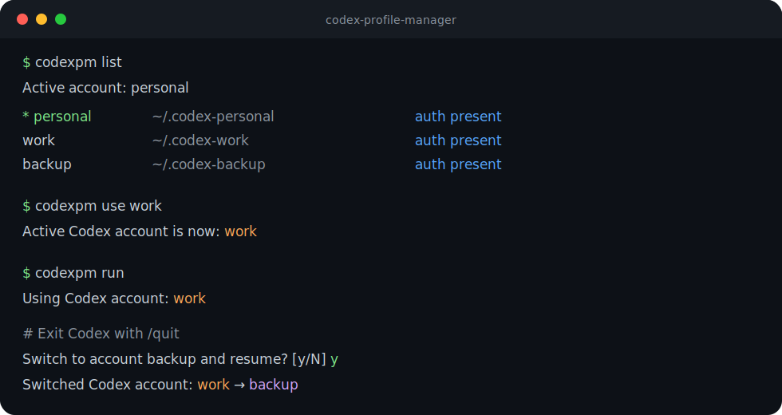

# Visual demo

<p align="center">
  
</p>

The example shows the core workflow:

1. list configured profiles;
2. choose a profile;
3. launch Codex with the active profile;
4. optionally rotate to the next profile after `/quit`.

```bash
codexpm list
codexpm use work
codexpm run
```
